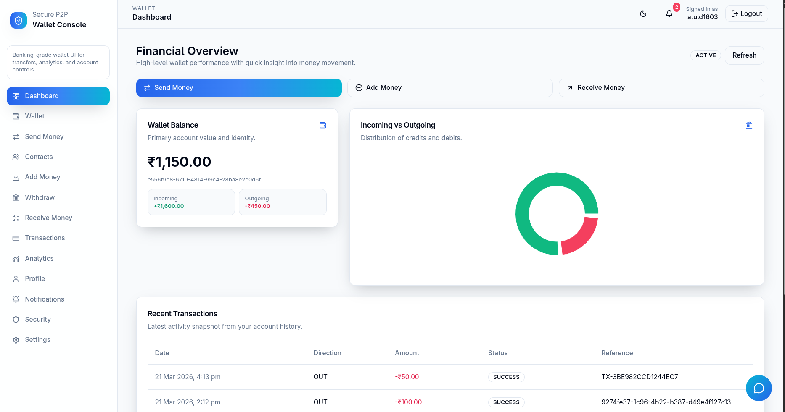
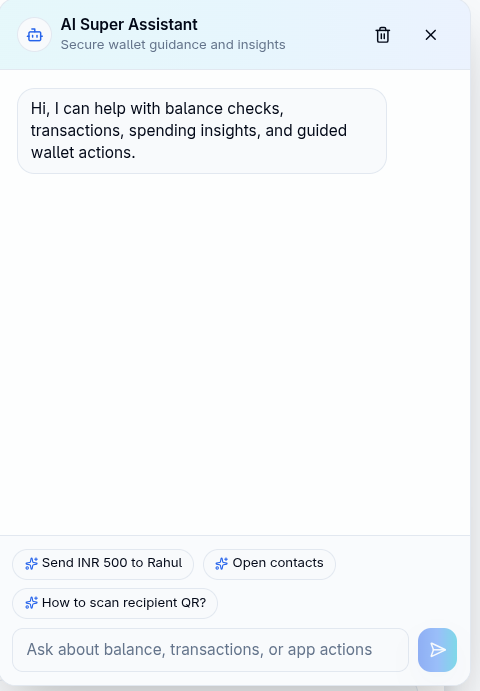
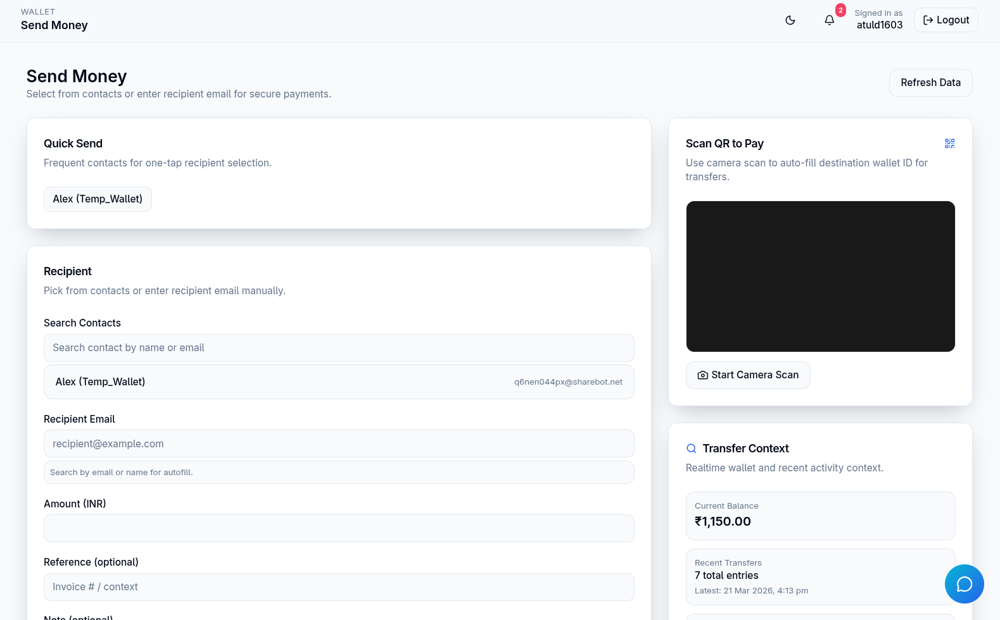
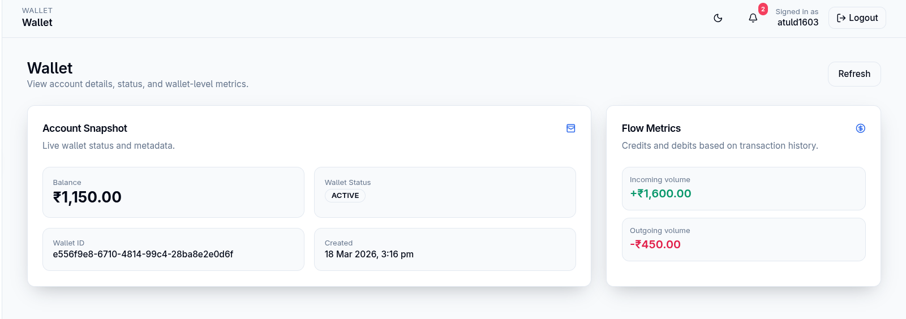

# Secure P2P Wallet System


A production-minded digital wallet platform for fast, secure peer-to-peer money movement.

From login to transfer, every step is engineered with fintech-grade safety, strong UX, and extensible architecture. 

## 1. 🚀 Project Title & Tagline

## Secure P2P Wallet System

### Modern, secure, AI-enhanced wallet infrastructure for next-generation digital payments.

Secure P2P Wallet System is a full-stack fintech application that enables users to authenticate with JWT + OTP, manage balances, transfer funds, withdraw to bank accounts, and receive real-time updates, all in a smooth web experience.

## 2. 📸 Preview Section

<div align="center">
  <table style="width:100%">
    <tr>
      <td width="50%">
        <p align="center"><b>📊 Dashboard Overview</b></p>
        
      </td>
      <td width="50%">
        <p align="center"><b>🤖 AI Smart Assistant</b></p>
        
      </td>
    </tr>
    <tr>
      <td width="33.3%">
        <p align="center"><b>💸 Send & Receive</b></p>
        
      </td>
      <td width="33.3%">
        <p align="center"><b>🏦 Wallet Management</b></p>
        
      </td>
    </tr>
  </table>
</div>

## 3. ✨ Features

### 🔐 Authentication

- JWT-based authentication with access/refresh token strategy
- Email OTP verification for account security (2FA flow)
- Secure login and signup endpoints
- Session-aware profile security actions (password change, session checks)

### 💰 Wallet System

- Wallet creation and personal balance retrieval
- Balance updates with protected backend validation
- Add money workflow via Razorpay test integration

### 🔄 Transactions

- Peer-to-peer transfer between users
- Contact-assisted payments for faster repeat transfers
- Full transaction history and filtering-ready design
- QR-ready receive-money flow for frictionless collection

### 🏦 Withdraw System

- Bank account link and management
- Simulated withdrawal payout processing queue
- Withdrawal records and status visibility

### 🔔 Notifications

- Real-time user notification stream via WebSocket (STOMP + SockJS)
- Read single notification / mark all as read
- Notification cleanup with delete APIs

### 🤖 AI Assistant

- App-wide floating assistant integrated into user workflow
- Page-aware context for smarter answers and actions
- Structured actions (`NAVIGATE`, `PREFILL_FORM`, `OPEN_MODAL`) for guided UX
- Provider-ready architecture (Gemini/OpenAI) with deterministic fallback

### ⚙️ Settings & Profile

- Profile details management and avatar upload
- Password change and account personalization
- User preferences endpoint for configurable experience

## 4. 🧠 System Architecture

The system follows a clean client-server architecture optimized for fintech reliability:

- Frontend (React + Vite): Handles UI, route protection, form validation, and real-time subscription handling.
- Backend (Spring Boot): Exposes REST APIs for auth, wallet, transfer, withdrawals, profile, and AI operations.
- Database (PostgreSQL): Persists users, wallet data, transactions, contacts, withdrawals, and notifications.
- Real-time Channel (WebSocket): Uses STOMP with SockJS endpoint `/ws`, broker `/topic`, and app prefix `/app`.
- API Gateway Pattern (Frontend Proxy): Dev server proxies `/api` to backend for local cross-origin simplicity.

High-level request flow:

1. User action starts in React page.
2. Frontend calls backend REST API (typically via `/api/...` in dev).
3. Spring Security validates JWT and authorization.
4. Business layer performs wallet/transaction logic.
5. PostgreSQL state is updated and optional WebSocket event is pushed.
6. UI updates balance/history/notifications in near real time.

## 5. 🏗️ Tech Stack

### Frontend

- React 19
- TypeScript
- Vite
- Tailwind CSS
- Framer Motion
- TanStack React Query
- Zustand
- SockJS + STOMP client

### Backend

- Java 21
- Spring Boot 3.2
- Spring Security
- Spring Data JPA
- Spring WebSocket
- Flyway
- Razorpay Java SDK

### Database

- PostgreSQL 15

### DevOps

- Docker + Docker Compose
- Kubernetes manifests (`k8s/backend`, `k8s/frontend`, `k8s/database`)

## 6. 📂 Project Structure

```text
.
├── frontend/                # React + TypeScript client
├── src/                     # Spring Boot backend source
├── docker/                  # Dockerfiles and Nginx config
├── k8s/                     # Kubernetes manifests
├── docker-compose.yml       # Local multi-container setup
├── pom.xml                  # Backend dependencies and build
└── .env.example             # Environment template
```

Conceptual mapping requested by many teams:

- `/frontend` -> Frontend app
- `/backend` -> Implemented as repo-root Spring Boot project (`/src`, `pom.xml`)
- `/docker` -> Container setup
- `/k8s` -> Cluster deployment setup

## 7. ⚙️ Setup Instructions

### Prerequisites

- Node.js 20+ and npm
- Java 21
- Maven 3.9+
- Docker and Docker Compose
- PostgreSQL (if running without Docker)

### Run Locally (Without Docker)

#### 1) Backend setup

```bash
cp .env.example .env
mvn clean install
mvn spring-boot:run
```

Backend runs on: `http://localhost:8080`

#### 2) Frontend setup

```bash
cd frontend
npm install
npm run dev
```

Frontend runs on: `http://localhost:5173` (default Vite)

### Run With Docker Compose (Recommended)

From project root:

```bash
cp .env.example .env
docker compose up --build
```

Service URLs:

- Frontend: `http://localhost:3000`
- Backend: `http://localhost:8080`
- PostgreSQL: `localhost:5432`

Stop services:

```bash
docker compose down
```

## 8. 🔑 Environment Variables

Create and maintain `.env` using `.env.example` as template.

Core variables:

- `JWT_SECRET`
- `JWT_ACCESS_TOKEN_EXPIRATION_MS`
- `JWT_REFRESH_TOKEN_EXPIRATION_MS`
- `DATABASE_URL`
- `DATABASE_USERNAME`
- `DATABASE_PASSWORD`

Razorpay:

- `RAZORPAY_KEY_ID`
- `RAZORPAY_KEY_SECRET`
- `RAZORPAY_CURRENCY`

Email/OTP (SMTP):

- `SMTP_HOST`
- `SMTP_PORT`
- `SMTP_USERNAME`
- `SMTP_PASSWORD`
- `MAIL_FROM`
- `OTP_ENABLED`

AI assistant provider:

- `AI_PROVIDER` (`GEMINI`, `OPENAI`, `NONE`)
- `GEMINI_API_KEY`
- `GEMINI_MODEL`
- `OPENAI_API_KEY`
- `OPENAI_MODEL`

Important security note:

- Never commit real API keys, SMTP passwords, or secrets.
- Rotate any credential that was ever exposed in a public repo or shared screenshot.

## 9. 🔄 API Overview

Representative API groups:

### Auth

- `POST /auth/register`
- `POST /auth/login`
- `POST /auth/verify-email`
- `POST /auth/verify-otp`

### Wallet

- `POST /wallets/me`
- `GET /wallets/me`
- `POST /wallets/deposit`

### Transactions

- `POST /transactions/transfer`
- `GET /transactions/history`

### Notifications

- `GET /notifications`
- `POST /notifications/{id}/read`
- `POST /notifications/read-all`

### AI Assistant

- `POST /ai/chat`

Additional modules:

- `/payments` (Razorpay flow)
- `/withdraw` and `/withdrawals`
- `/contacts`
- `/profile`
- `/preferences`

## 10. 🧪 Testing

Backend tests:

```bash
mvn test
```

Frontend quality checks:

```bash
cd frontend
npm run lint
npm run build
```

Suggested manual test scenarios:

1. Register -> verify email OTP -> login.
2. Create wallet -> add money -> confirm balance update.
3. Send money to a contact -> verify sender/receiver history.
4. Trigger withdrawal -> verify status appears in withdrawal history.
5. Open two browser sessions -> validate real-time notifications.
6. Ask AI: "Send 500 to Rahul" -> verify guided prefill action.

## 11. 🔒 Security Features

- JWT-secured API routes
- OTP-based verification layer for authentication hardening
- Spring Security authorization controls
- Controlled wallet transaction flows with backend validation
- Encrypted-sensitive configuration pattern via environment variables
- Security-first defaults in infrastructure and health exposure

## 12. 🤖 AI Integration

The AI assistant is designed for assistive fintech UX, not unrestricted autonomous actions.

What AI does:

- Understands user intents within wallet pages
- Provides contextual help for send/add/withdraw flows
- Can trigger safe, structured UI actions for faster task completion

How it enhances UX:

- Reduces friction for repeat operations
- Makes complex wallet workflows easier for beginners
- Improves discoverability of features from natural language prompts

Safety considerations:

- Provider abstraction supports fallback if LLM is unavailable
- Deterministic fallback prevents total assistant outage
- Action mapping is structured and sanitized before execution
- Authentication context is preserved; no privileged bypass via AI

## 13. 🚀 Future Enhancements

- Real Razorpay payouts for live withdrawal settlement
- Rule-based and ML-assisted fraud detection
- Admin operations panel with risk controls and audit tools
- Redis caching for low-latency balance/notification reads
- Mobile push notifications (FCM/APNs)
- Advanced analytics and spending intelligence

## 14. 📌 Highlights

- Fintech-focused full-stack architecture, not a basic CRUD demo
- End-to-end flows: authentication, wallet, transfers, payouts, notifications
- AI assistant integrated as a real product capability with guardrails
- Deployment-ready container and Kubernetes foundations
- Engineering decisions aligned with production-readiness and extensibility
---
